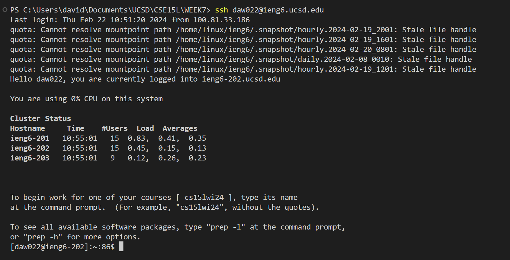
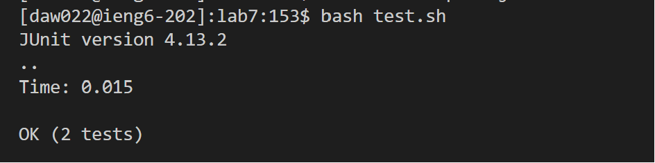

4. 

I typed in ```ssh daw022@ieng6.ucsd.edu <enter>```. This command let me log into ieng6. 

5.

I typed in ```git clone git@github.com:dwang88/lab7.git <enter>```. This command clone my forked github repo. 

6.

I typed in ```bash test.sh <enter>```. This command runs the tesh.sh file, which contains the lines to execute the program. 

7.

I typed in ```<k><k><k><k><k><l><l><l><l><l><l><l><l><l><l><l>xi2 <esc> :wq```. This allowed me to navigate to the line with the error, delete, and insert 2. Then I saved and exited the file. 

8.

I typed in ```bash test.sh <enter>```. This command runs the tesh.sh file, which contains the lines to execute the program. It passed all of the tests this time :O!

9.

I typed in ```git add .```, ```git commit -m"yurr"```, and ```git push``` to add all of the files, add a commit message (to show on the github repo), and push to the repo. 
